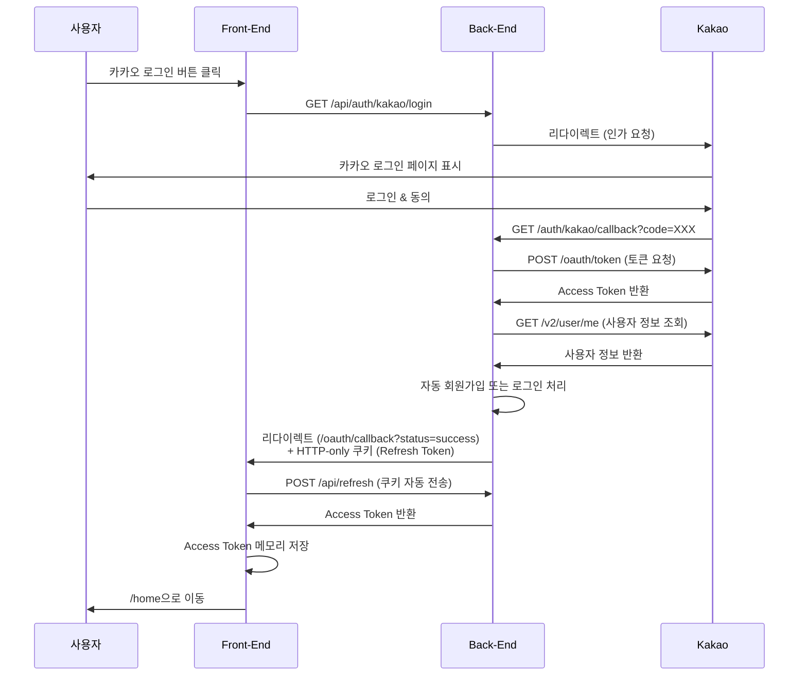

# 카카오 로그인 프로세스 가이드 (프론트엔드 관점)

## 📌 개요

이 문서는 React 프론트엔드에서 카카오 소셜 로그인을 어떻게 처리하는지 설명합니다.
백엔드와의 통신 흐름, 토큰 관리, 보안 고려사항을 중심으로 작성되었습니다.

## 🔐 보안 아키텍처

### 토큰 관리 방식

| 토큰 종류 | 저장 위치 | 접근 방법 | 보안 특성 |
|----------|---------|---------|----------|
| **Access Token** | React State (메모리) | AuthContext를 통해 접근 | XSS 공격에 취약하지만 페이지 새로고침 시 사라짐 |
| **Refresh Token** | HTTP-only 쿠키 | JavaScript로 접근 불가 | XSS 공격으로부터 안전, 브라우저가 자동 관리 |
| **사용자 정보** | React State + localStorage | AuthContext 또는 localStorage | UX 개선용 (페이지 로딩 시 이름 표시) |

### 보안 원칙

1. **Access Token은 절대 localStorage에 저장하지 않음** (XSS 방어)
2. **Refresh Token은 HTTP-only 쿠키로만 관리** (JavaScript 접근 차단)
3. **세션을 통한 안전한 토큰 전달** (CSRF 방어)
4. **withCredentials: true로 쿠키 자동 전송** (CORS 환경)

## 📡 API 엔드포인트

### 백엔드 엔드포인트
| 메서드 | 경로 | 설명 |
|--------|------|------|
| GET | `/api/auth/kakao/login` | 카카오 로그인 시작 |
| GET | `/api/auth/kakao/callback` | 카카오 콜백 (백엔드 자동 처리) |
| POST | `/api/auth/kakao/exchange-token` | 세션에서 JWT 토큰 교환 (핵심!) |
| POST | `/api/refresh` | Access Token 갱신 |
| POST | `/api/loginEx` | 이메일 로그인 |
| POST | `/api/logout` | 로그아웃 |

## 🚀 카카오 로그인 전체 플로우

### 단계별 프로세스

```text
[사용자] ──1──> [Login.jsx] ──2──> [백엔드] ──3──> [카카오 인증 서버]
                                                         │
                                                         4
                                                         │
                                                         ↓
[홈 페이지] <──9── [OAuthCallback.jsx] <──8── [백엔드] <──5── [카카오 콜백]
    (로그인 완료)         ↓
                         6
                         ↓
                    [/api/auth/kakao/exchange-token]
                         ↓
                         7
                         ↓
                    [백엔드에서 토큰 반환]
```

### 상세 설명

#### **1단계: 사용자가 "카카오 로그인" 버튼 클릭**

- 위치: [Login.jsx](src/pages/Login.jsx)
- 함수: `handleKakaoLogin()`
- 동작: `window.location.href = '/api/auth/kakao/login'`

**일어나는 일:**

- 전체 페이지가 리다이렉트됨 (SPA가 아닌 전통적인 페이지 이동)
- React 앱의 모든 상태가 초기화됨
- Vite proxy가 `/api` → `http://localhost:9080`으로 변환

#### **2단계: 백엔드가 카카오 인증 서버로 리다이렉트**

- 백엔드 엔드포인트: `GET /auth/kakao/login`

**백엔드가 하는 일:**

1. 카카오 OAuth URL 생성
2. client_id, redirect_uri, response_type 등 파라미터 설정
3. 브라우저를 `https://kauth.kakao.com/oauth/authorize?...`로 리다이렉트

**브라우저 주소창 변화:**

```text
http://localhost:5173/login
  ↓
http://localhost:9080/auth/kakao/login
  ↓
https://kauth.kakao.com/oauth/authorize?client_id=...
```

#### **3-4단계: 사용자가 카카오 로그인 페이지에서 인증**

- 카카오 계정으로 로그인
- 앱 사용 동의
- 카카오 서버가 Authorization Code 생성

#### **5단계: 카카오가 백엔드 콜백 URL로 리다이렉트**

- 백엔드 엔드포인트: `GET /auth/kakao/callback?code=...`

**백엔드가 하는 일:**

1. Authorization Code를 받음
2. 카카오 서버에 Access Token 요청
3. 카카오 사용자 정보 조회
4. **JWT 토큰 생성** (accessToken, refreshToken)
5. **세션에 토큰들을 임시 저장** ← 중요!
6. 프론트엔드로 리다이렉트

**왜 세션을 사용하나요?**

- HTTP-only 쿠키는 localhost:9080에서 설정하면 localhost:5173에서 읽을 수 없음
- 세션은 서버 측에 저장되므로 도메인/포트 제약이 없음
- 프론트엔드가 명시적으로 토큰을 요청할 때까지 안전하게 보관

#### **6단계: OAuthCallback 컴포넌트가 토큰 교환 API 호출**

- URL: `http://localhost:5173/oauth/callback?status=success`
- 위치: [OAuthCallback.jsx:128](src/pages/OAuthCallback.jsx#L128)

**API 요청:**

- **메서드:** POST
- **URL:** `/api/auth/kakao/exchange-token`
- **요청 바디:** `{}` (빈 객체)
- **헤더:** `withCredentials: true` (세션 쿠키 자동 전송)

#### **7단계: 백엔드가 세션에서 토큰을 꺼내서 응답**

**백엔드가 하는 일:**

1. 세션에서 임시 저장된 토큰들을 가져옴
2. **Refresh Token을 HTTP-only 쿠키로 설정**
3. **Access Token과 사용자 정보를 JSON 응답으로 반환**
4. 세션 정리 (임시 저장된 토큰 제거)

**응답 예시:**

```json
{
  "success": true,
  "message": "카카오 로그인 성공",
  "data": {
    "accessToken": "eyJhbGciOiJIUzUxMiJ9...",
    "user": {
      "id": 1,
      "email": "user@example.com",
      "name": "홍길동",
      "role": "USER"
    }
  }
}
```

**쿠키 헤더:**

```text
Set-Cookie: refreshToken=eyJhbGciOiJIUzUxMiJ9...; Path=/; HttpOnly; Max-Age=604800
```

#### **8단계: 프론트엔드가 AuthContext에 로그인 정보 저장**

- 위치: [OAuthCallback.jsx:151-166](src/pages/OAuthCallback.jsx#L151-L166)

**login 함수가 하는 일:** ([AuthProvider.jsx:102](src/contexts/AuthProvider.jsx#L102))

1. React State에 저장 (메모리)
2. localStorage에 사용자 정보만 저장 (UX 개선용)

**저장 결과:**

- **React State:** `{ user: {...}, accessToken: "eyJ..." }`
- **localStorage:** `{ user: {...} }` (accessToken은 제외!)
- **HTTP-only 쿠키:** `refreshToken=eyJ...` (브라우저가 자동 관리)

#### **9단계: 홈 페이지로 이동 (로그인 완료)**

- `navigate('/')`
- 이제 사용자는 인증된 상태!

---

## 📝 구현 단계

### 1단계: 카카오 로그인 버튼 추가

**파일:** [src/pages/Login.jsx](src/pages/Login.jsx)

```jsx
const handleKakaoLogin = () => {
  // 백엔드의 카카오 로그인 시작 엔드포인트로 전체 페이지 리다이렉트
  // - 브라우저가 http://localhost:9080/auth/kakao/login 으로 이동
  // - 백엔드는 이 요청을 받아 카카오 인증 서버로 다시 리다이렉트
  // - 현재 페이지(Login.jsx)는 언마운트되고 모든 상태가 사라짐
  window.location.href = '/api/auth/kakao/login';
}

// JSX
<button
  type="button"
  className="kakao-login-button"
  onClick={handleKakaoLogin}
>
  <svg className="kakao-icon" width="18" height="18" viewBox="0 0 18 18" fill="none">
    <path d="M9 0C4.029 0 0 3.285 0 7.333c0 2.55 1.65 4.794 4.14 6.075l-1.05 3.87c-.09.33.24.6.54.45l4.56-3.03c.27.03.54.045.81.045 4.971 0 9-3.285 9-7.333C18 3.285 13.971 0 9 0z" fill="currentColor"/>
  </svg>
  카카오 로그인
</button>
```

**중요 사항:**

- `window.location.href`는 전체 페이지 리다이렉트 (SPA가 아님)
- React 상태가 모두 초기화됨
- Vite proxy가 `/api` → `http://localhost:9080`으로 변환

---

### 2단계: OAuth 콜백 페이지 생성

**파일:** [src/pages/OAuthCallback.jsx](src/pages/OAuthCallback.jsx)

백엔드는 카카오 인증 후 `http://localhost:5173/oauth/callback?status=success`로 리다이렉트합니다.

```jsx
import { useEffect, useState } from 'react';
import { useNavigate, useSearchParams } from 'react-router-dom';
import { useAuth } from '../hooks/useAuth';
import axios from 'axios';

function OAuthCallback() {
  const navigate = useNavigate();
  const [searchParams] = useSearchParams();
  const { login } = useAuth();  // login 함수 사용 (refreshAccessToken 아님!)

  const [isLoading, setIsLoading] = useState(true);
  const [error, setError] = useState(null);

  useEffect(() => {
    const handleCallback = async () => {
      try {
        const status = searchParams.get('status');
        const errorMessage = searchParams.get('error');

        // 에러 처리
        if (errorMessage) {
          console.error('카카오 로그인 실패:', decodeURIComponent(errorMessage));
          setError(decodeURIComponent(errorMessage));
          setIsLoading(false);
          setTimeout(() => navigate('/login'), 3000);
          return;
        }

        // 성공 처리 - 토큰 교환 요청
        if (status === 'success') {
          try {
            // 🔑 핵심: 세션에서 JWT 토큰을 가져오는 API 호출
            const response = await axios.post('/api/auth/kakao/exchange-token', {}, {
              withCredentials: true  // 세션 쿠키 전송 필수!
            });

            if (response.data.success) {
              const { accessToken, user } = response.data.data;

              // AuthContext에 로그인 정보 저장
              login(user, accessToken);

              alert('카카오 로그인 성공!');
              navigate('/');
            } else {
              throw new Error(response.data.message || '토큰 교환 실패');
            }
          } catch (error) {
            console.error('토큰 교환 실패:', error);
            setError('로그인 처리 중 오류가 발생했습니다.');
            setIsLoading(false);
            setTimeout(() => navigate('/login'), 3000);
          }
        } else {
          console.error('알 수 없는 콜백 상태:', status);
          setError('알 수 없는 오류가 발생했습니다.');
          setIsLoading(false);
          setTimeout(() => navigate('/login'), 3000);
        }
      } catch (err) {
        console.error('OAuth 콜백 처리 에러:', err);
        setError('로그인 처리 중 오류가 발생했습니다.');
        setIsLoading(false);
        setTimeout(() => navigate('/login'), 3000);
      }
    };

    handleCallback();
  }, [searchParams, navigate, login]);

  return (
    <div className="oauth-callback-container">
      <div className="oauth-callback-card">
        {isLoading ? (
          <>
            <div className="spinner"></div>
            <h2>로그인 처리 중...</h2>
            <p>잠시만 기다려주세요.</p>
          </>
        ) : (
          <>
            <div className="error-icon">⚠️</div>
            <h2>로그인 실패</h2>
            <p>{error}</p>
            <p className="redirect-message">로그인 페이지로 이동합니다...</p>
          </>
        )}
      </div>
    </div>
  );
}

export default OAuthCallback;
```

**핵심 포인트:**

- `refreshAccessToken()` 대신 `login(user, accessToken)` 사용
- `/api/auth/kakao/exchange-token` 엔드포인트 호출
- `withCredentials: true` 필수 (세션 쿠키 전송)
- 3초 후 자동 리다이렉트 (에러 발생 시)

### 3단계: 라우터 설정

```jsx
// src/App.jsx 또는 라우터 설정 파일
import { BrowserRouter, Routes, Route } from 'react-router-dom'
import OAuthCallback from './pages/OAuthCallback'
import Login from './pages/Login'
import Home from './pages/Home'

function App() {
  return (
    <BrowserRouter>
      <Routes>
        <Route path="/login" element={<Login />} />
        <Route path="/oauth/callback" element={<OAuthCallback />} />  {/* 추가 */}
        <Route path="/home" element={<Home />} />
        {/* 기타 라우트... */}
      </Routes>
    </BrowserRouter>
  )
}

export default App
```

## 🔄 카카오 로그인 플로우



## ⚙️ 필수 설정

### Vite Proxy 설정 (vite.config.js)

```javascript
export default defineConfig({
  plugins: [react()],
  server: {
    proxy: {
      '/api': {
        target: 'http://127.0.0.1:9080',  // 백엔드 주소
        changeOrigin: true,
        rewrite: (path) => path.replace(/^\/api/, '')
      }
    }
  }
})
```

### Axios 설정 (axiosConfig.js)

```javascript
const apiClient = axios.create({
  baseURL: '/api',
  headers: {
    'Content-Type': 'application/json'
  },
  withCredentials: true  // ✅ 쿠키 전송 허용 (필수!)
})
```

### AuthProvider 설정

AuthProvider에 `refreshAccessToken` 함수가 반드시 구현되어 있어야 합니다:

```javascript
// AuthProvider.jsx
const refreshAccessToken = useCallback(async () => {
  try {
    // 웹 브라우저: 쿠키에서 자동으로 Refresh Token을 읽으므로 요청 바디 없음
    const refreshToken = sessionStorage.getItem('refreshToken')
    const hasRefreshCookie = document.cookie.includes('refreshToken')

    const requestBody = refreshToken ? { refreshToken } : undefined

    if (!refreshToken && !hasRefreshCookie) {
      throw new Error('Refresh Token이 없습니다. 다시 로그인해주세요.')
    }

    const response = await apiClient.post('/refresh', requestBody)

    if (response.data.success) {
      const newAccessToken = response.data.data.accessToken
      setAccessTokenState(newAccessToken)
      return newAccessToken
    } else {
      throw new Error(response.data.message || '토큰 갱신에 실패했습니다.')
    }
  } catch (error) {
    // Refresh Token도 만료된 경우 로그아웃 처리
    setAccessTokenState(null)
    setUser(null)
    throw error
  }
}, [])
```

## 🧪 테스트 방법

### 1. 백엔드 실행
```bash
cd /Users/eunbumkim/Documents/practice/java/myauth
./gradlew bootRun
```

### 2. 프론트엔드 실행
```bash
cd /Users/eunbumkim/Documents/practice/react/sbs
npm run dev
```

### 3. 테스트 순서
1. http://localhost:5173/login 접속
2. "카카오로 로그인" 버튼 클릭
3. 카카오 계정으로 로그인
4. 자동으로 `/oauth/callback`으로 리다이렉트
5. Access Token 자동 발급 후 `/home`으로 이동

## 🐛 트러블슈팅

### 문제 1: "Invalid CORS request" 403 에러

**증상:**

```text
POST http://localhost:5173/api/refresh 403 (Forbidden)
에러 메시지: Invalid CORS request
```

**원인:** 백엔드 CORS 설정에서 `allow-credentials: true` 누락

**해결:**

```yaml
# application-dev.yaml (백엔드)
app:
  cors:
    allowed-origins:
      - http://localhost:5173
    allow-credentials: true  # 🔒 필수!
```

---

### 문제 2: "Refresh Token은 필수입니다" 400 에러

**증상:**

```text
POST http://localhost:5173/api/refresh 400 (Bad Request)
에러 메시지: Refresh Token은 필수입니다
```

**원인:**

- Cross-port 쿠키 공유 문제
- localhost:9080에서 설정한 쿠키를 localhost:5173에서 읽을 수 없음
- 쿠키가 브라우저에는 존재하지만 백엔드가 요청에서 읽지 못함

**해결:** 세션 기반 토큰 교환 방식으로 변경 (백엔드 아키텍처 변경 필요)

1. 백엔드: 카카오 콜백에서 세션에 토큰 저장
2. 백엔드: `/auth/kakao/exchange-token` 엔드포인트 추가
3. 프론트엔드: OAuthCallback.jsx에서 exchange-token 호출

---

### 문제 3: 500 Internal Server Error (redirectUrl 파라미터)

**증상:**

```text
GET http://localhost:5173/api/auth/kakao/login?redirectUrl=... 500 (Internal Server Error)
```

**원인:** 백엔드가 redirectUrl 파라미터를 지원하지 않음

**해결:**

```javascript
// ❌ 잘못된 방식
const handleKakaoLogin = () => {
  const callbackUrl = encodeURIComponent('http://localhost:5173/oauth/callback');
  window.location.href = `/api/auth/kakao/login?redirectUrl=${callbackUrl}`;
}

// ✅ 올바른 방식
const handleKakaoLogin = () => {
  window.location.href = '/api/auth/kakao/login';
}
```

---

### 문제 4: refreshToken 쿠키가 생성되지 않음

**증상:** 브라우저 개발자 도구 > Application > Cookies에 refreshToken이 없음

**원인:** `withCredentials: true` 누락

**해결:**

```javascript
// OAuthCallback.jsx
const response = await axios.post('/api/auth/kakao/exchange-token', {}, {
  withCredentials: true  // 🔒 필수!
});
```

---

### 문제 5: 무한 리다이렉트 루프

**증상:** `/oauth/callback` ↔ `/login` 무한 반복

**원인:**

- `/oauth/callback` 라우트가 없음
- `login()` 함수 호출 실패

**해결:**

1. 라우터에 `/oauth/callback` 경로 추가 확인
2. AuthProvider의 `login` 함수 구현 확인
3. useAuth 훅이 제대로 import 되었는지 확인

---

### 문제 6: CORS 에러

**증상:**

```text
Access to XMLHttpRequest at 'http://localhost:9080/...' from origin 'http://localhost:5173' has been blocked by CORS policy
```

**원인:** 백엔드 CORS 설정에 프론트엔드 URL이 없음

**해결:**

```yaml
# application-dev.yaml (백엔드)
app:
  cors:
    allowed-origins:
      - http://localhost:5173  # 프론트엔드 URL 추가
    allow-credentials: true
```

## 📝 추가 기능

### 이메일 로그인과 카카오 로그인 통합

```jsx
// Login.jsx
import { useState } from 'react'
import { useNavigate } from 'react-router-dom'
import { useAuth } from '../contexts/useAuth'

function Login() {
  const { login } = useAuth()
  const navigate = useNavigate()
  const [formData, setFormData] = useState({ email: '', password: '' })

  // 이메일 로그인
  const handleEmailLogin = async (e) => {
    e.preventDefault()
    try {
      await login(formData.email, formData.password)  // /loginEx 호출
      alert('로그인 성공!')
      navigate('/home')
    } catch (error) {
      alert(error.message || '로그인에 실패했습니다.')
    }
  }

  // 카카오 로그인
  const handleKakaoLogin = () => {
    window.location.href = '/api/auth/kakao/login'
  }

  return (
    <div className="login-container">
      {/* 이메일 로그인 폼 */}
      <form onSubmit={handleEmailLogin}>
        <input
          type="email"
          placeholder="이메일"
          value={formData.email}
          onChange={(e) => setFormData({ ...formData, email: e.target.value })}
        />
        <input
          type="password"
          placeholder="비밀번호"
          value={formData.password}
          onChange={(e) => setFormData({ ...formData, password: e.target.value })}
        />
        <button type="submit">이메일로 로그인</button>
      </form>

      {/* 구분선 */}
      <div className="divider">또는</div>

      {/* 카카오 로그인 버튼 */}
      <button onClick={handleKakaoLogin} className="kakao-login-button">
        <i className="fas fa-comment"></i>
        카카오로 로그인
      </button>
    </div>
  )
}

export default Login
```

### 로그아웃 구현

```jsx
// Home.jsx 또는 네비게이션 컴포넌트
import { useAuth } from '../contexts/useAuth'
import { useNavigate } from 'react-router-dom'

function Home() {
  const { logout, user } = useAuth()
  const navigate = useNavigate()

  const handleLogout = async () => {
    try {
      await logout()  // /logout API 호출
      alert('로그아웃 되었습니다.')
      navigate('/login')
    } catch (error) {
      console.error('로그아웃 실패:', error)
    }
  }

  return (
    <div>
      <h1>환영합니다, {user?.name}님!</h1>
      <button onClick={handleLogout}>로그아웃</button>
    </div>
  )
}

export default Home
```

## 🔒 보안 체크리스트

### ✅ 구현된 보안 기능

- [x] Access Token은 메모리(React State)에만 저장
- [x] Refresh Token은 HTTP-only 쿠키로 관리
- [x] localStorage에 민감한 정보 저장 안 함 (사용자 정보만 저장)
- [x] withCredentials: true로 쿠키 전송
- [x] CORS allow-credentials 설정
- [x] 세션 기반 안전한 토큰 전달
- [x] 토큰 갱신 메커니즘 구현
- [x] 에러 처리 및 자동 리다이렉트
- [x] Access Token을 URL 파라미터로 전달하지 않음

### ⚠️ 추가 고려사항

- [ ] HTTPS 사용 (프로덕션 환경)
- [ ] Secure 쿠키 플래그 (프로덕션 환경)
- [ ] SameSite=Strict 쿠키 속성 (CSRF 방어)
- [ ] Content Security Policy 헤더
- [ ] Rate Limiting (무차별 대입 공격 방어)
- [ ] 로그아웃 시 모든 토큰 제거

## 🎨 UI 개선 팁

### 카카오 로그인 버튼 스타일

```css
/* Login.css */
.kakao-login-button {
  background-color: #FEE500;  /* 카카오 브랜드 색상 */
  color: #000000;
  border: none;
  padding: 12px 24px;
  border-radius: 8px;
  font-size: 16px;
  font-weight: bold;
  cursor: pointer;
  display: flex;
  align-items: center;
  gap: 8px;
  width: 100%;
  justify-content: center;
}

.kakao-login-button:hover {
  background-color: #FDD835;
}

.kakao-login-button i {
  font-size: 20px;
}
```

### 로딩 화면 개선

```jsx
// OAuthCallback.jsx
return (
  <div style={{
    display: 'flex',
    flexDirection: 'column',
    justifyContent: 'center',
    alignItems: 'center',
    height: '100vh',
    backgroundColor: '#f5f5f5'
  }}>
    <div style={{
      width: '50px',
      height: '50px',
      border: '5px solid #e0e0e0',
      borderTop: '5px solid #FEE500',
      borderRadius: '50%',
      animation: 'spin 1s linear infinite'
    }}></div>
    <h2 style={{ marginTop: '20px', color: '#333' }}>로그인 처리 중...</h2>
    <p style={{ color: '#666' }}>잠시만 기다려주세요.</p>

    <style>{`
      @keyframes spin {
        0% { transform: rotate(0deg); }
        100% { transform: rotate(360deg); }
      }
    `}</style>
  </div>
)
```

## 📝 요약

### 핵심 포인트

1. **세션 기반 토큰 교환**: 백엔드가 세션에 임시 저장 → 프론트엔드가 명시적으로 요청
2. **HTTP-only 쿠키**: Refresh Token은 JavaScript 접근 차단으로 XSS 방어
3. **withCredentials: true**: 모든 인증 관련 API 요청에 필수
4. **Vite Proxy**: CORS 문제 우회 및 개발 편의성 향상
5. **AuthContext**: 전역 인증 상태 관리 및 자동 로그인

### 개발자가 알아야 할 사항

- 카카오 로그인은 **전체 페이지 리다이렉트** 방식 (React 상태 초기화됨)
- **OAuthCallback 컴포넌트**가 실제 로그인 처리의 핵심
- **토큰 갱신**은 axios interceptor로 자동화 가능
- **localStorage는 UX 개선용**으로만 사용 (보안에 의존하면 안 됨)

### 프론트엔드 관점의 카카오 로그인 플로우 요약

```text
1. 사용자 클릭 → 백엔드로 페이지 리다이렉트
2. 백엔드 → 카카오 인증 서버로 리다이렉트
3. 사용자 인증 → 카카오가 백엔드로 콜백
4. 백엔드가 세션에 JWT 토큰 저장 → 프론트엔드로 리다이렉트
5. OAuthCallback 컴포넌트가 exchange-token API 호출
6. 백엔드가 세션에서 토큰 꺼내서 응답 (HTTP-only 쿠키 + JSON)
7. 프론트엔드가 AuthContext에 저장
8. 홈 페이지로 이동 (로그인 완료!)
```

---

## 📚 참고 자료

- [카카오 로그인 공식 문서](https://developers.kakao.com/docs/latest/ko/kakaologin/common)
- [OAuth 2.0 RFC](https://datatracker.ietf.org/doc/html/rfc6749)
- [JWT 공식 사이트](https://jwt.io/)
- [MDN - HTTP Cookies](https://developer.mozilla.org/ko/docs/Web/HTTP/Cookies)
- [OWASP - XSS Prevention](https://cheatsheetseries.owasp.org/cheatsheets/Cross_Site_Scripting_Prevention_Cheat_Sheet.html)
- [React Router 문서](https://reactrouter.com/)
- [Axios 문서](https://axios-http.com/)
- [Vite Proxy 설정](https://vitejs.dev/config/server-options.html#server-proxy)

## 💡 추가 고려사항

### 모바일 앱 지원
현재 구현은 웹 브라우저에 최적화되어 있습니다. 모바일 앱에서는:
- Refresh Token을 쿠키 대신 응답 바디로 받음
- sessionStorage에 저장하여 관리

### 프로덕션 배포 시 주의사항
1. **HTTPS 사용**: 쿠키 Secure 플래그를 true로 설정
2. **환경 변수 관리**: API URL을 환경 변수로 분리
3. **에러 로깅**: 프로덕션 환경에서는 Sentry 등 에러 추적 도구 사용
4. **카카오 앱 설정**: 카카오 개발자 콘솔에서 프로덕션 도메인 추가

```yaml
# application-prod.yaml (백엔드)
app:
  cookie:
    secure: true  # 프로덕션에서는 true
  cors:
    allowed-origins:
      - https://yourdomain.com  # 실제 프로덕션 도메인
  oauth:
    kakao-redirect-url: https://yourdomain.com/oauth/callback
```

## 🤝 문제 해결 지원

문제가 발생하면:
1. 브라우저 개발자 도구의 Network 탭에서 요청/응답 확인
2. 백엔드 로그 확인 (`./gradlew bootRun` 실행 터미널)
3. 쿠키 설정 확인 (Application > Cookies)
4. CORS 에러 확인 (Console 탭)
