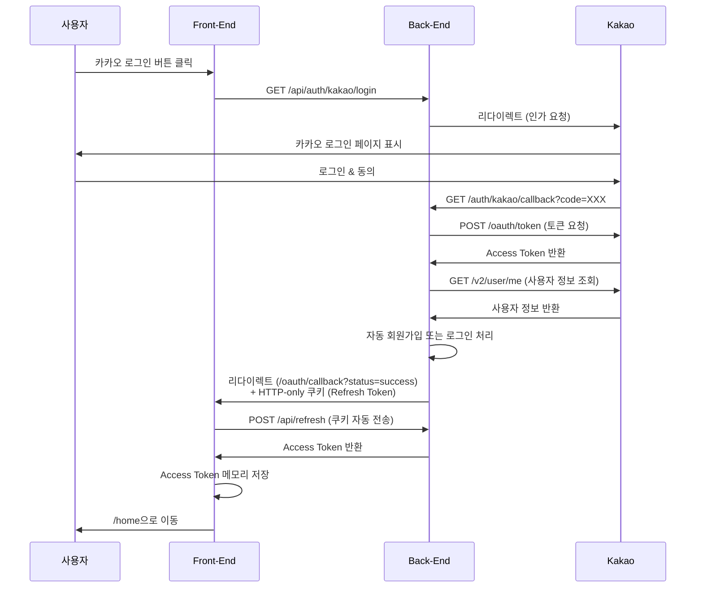

# 카카오 로그인 Front-End 구현 가이드

## 📌 개요

이 문서는 Spring Boot 백엔드의 카카오 OAuth 로그인 기능을 React 프론트엔드에서 사용하는 방법을 안내합니다.

## 🔐 보안 아키텍처

### 토큰 관리 방식
- **Refresh Token**: HTTP-only 쿠키 (XSS 공격 방어)
- **Access Token**: 메모리 저장 (React State + 모듈 변수)
- **사용자 정보**: sessionStorage

### 보안 개선 사항
- ✅ Access Token을 URL에 노출하지 않음
- ✅ Refresh Token을 HTTP-only 쿠키로 전송
- ✅ CORS `withCredentials: true` 설정

## 📡 API 엔드포인트

### 백엔드 엔드포인트
| 메서드 | 경로 | 설명 |
|--------|------|------|
| GET | `/api/auth/kakao/login` | 카카오 로그인 시작 |
| GET | `/api/auth/kakao/callback` | 카카오 콜백 (자동 처리) |
| POST | `/api/refresh` | Access Token 갱신 |
| POST | `/api/loginEx` | 이메일 로그인 (하이브리드 방식) |
| POST | `/api/logout` | 로그아웃 |

## 🚀 구현 단계

### 1단계: 카카오 로그인 버튼 추가

```jsx
// Login.jsx 또는 원하는 컴포넌트에 추가
const handleKakaoLogin = () => {
  // Vite proxy를 통해 백엔드로 요청이 전달됩니다
  // /api/auth/kakao/login → http://localhost:9080/auth/kakao/login
  window.location.href = '/api/auth/kakao/login'
}

// JSX
<button onClick={handleKakaoLogin}>
  <i className="fas fa-comment"></i>
  카카오로 로그인
</button>
```

### 2단계: OAuth 콜백 페이지 생성

백엔드는 카카오 인증 후 `http://localhost:5173/oauth/callback?status=success`로 리다이렉트합니다.

```jsx
// src/pages/OAuthCallback.jsx
import { useEffect } from 'react'
import { useNavigate, useSearchParams } from 'react-router-dom'
import { useAuth } from '../contexts/useAuth'

function OAuthCallback() {
  const navigate = useNavigate()
  const [searchParams] = useSearchParams()
  const { refreshAccessToken } = useAuth()

  useEffect(() => {
    const handleCallback = async () => {
      // URL 파라미터에서 상태 확인
      const status = searchParams.get('status')
      const error = searchParams.get('error')

      if (error) {
        // 에러 발생 시 처리
        console.error('카카오 로그인 실패:', decodeURIComponent(error))
        alert(`로그인 실패: ${decodeURIComponent(error)}`)
        navigate('/login')
        return
      }

      if (status === 'success') {
        try {
          // 백엔드가 설정한 Refresh Token 쿠키를 사용하여 Access Token 요청
          await refreshAccessToken()

          // 로그인 성공 후 홈으로 이동
          alert('카카오 로그인 성공!')
          navigate('/home')
        } catch (error) {
          console.error('토큰 갱신 실패:', error)
          alert('로그인 처리 중 오류가 발생했습니다.')
          navigate('/login')
        }
      } else {
        // 예상치 못한 상태
        console.error('알 수 없는 콜백 상태:', status)
        navigate('/login')
      }
    }

    handleCallback()
  }, [searchParams, refreshAccessToken, navigate])

  // 로딩 화면 표시
  return (
    <div style={{
      display: 'flex',
      justifyContent: 'center',
      alignItems: 'center',
      height: '100vh'
    }}>
      <div>
        <h2>로그인 처리 중...</h2>
        <p>잠시만 기다려주세요.</p>
      </div>
    </div>
  )
}

export default OAuthCallback
```

### 3단계: 라우터 설정

```jsx
// src/App.jsx 또는 라우터 설정 파일
import { BrowserRouter, Routes, Route } from 'react-router-dom'
import OAuthCallback from './pages/OAuthCallback'
import Login from './pages/Login'
import Home from './pages/Home'

function App() {
  return (
    <BrowserRouter>
      <Routes>
        <Route path="/login" element={<Login />} />
        <Route path="/oauth/callback" element={<OAuthCallback />} />  {/* 추가 */}
        <Route path="/home" element={<Home />} />
        {/* 기타 라우트... */}
      </Routes>
    </BrowserRouter>
  )
}

export default App
```

## 🔄 카카오 로그인 플로우



## ⚙️ 필수 설정

### Vite Proxy 설정 (vite.config.js)

```javascript
export default defineConfig({
  plugins: [react()],
  server: {
    proxy: {
      '/api': {
        target: 'http://127.0.0.1:9080',  // 백엔드 주소
        changeOrigin: true,
        rewrite: (path) => path.replace(/^\/api/, '')
      }
    }
  }
})
```

### Axios 설정 (axiosConfig.js)

```javascript
const apiClient = axios.create({
  baseURL: '/api',
  headers: {
    'Content-Type': 'application/json'
  },
  withCredentials: true  // ✅ 쿠키 전송 허용 (필수!)
})
```

### AuthProvider 설정

AuthProvider에 `refreshAccessToken` 함수가 반드시 구현되어 있어야 합니다:

```javascript
// AuthProvider.jsx
const refreshAccessToken = useCallback(async () => {
  try {
    // 웹 브라우저: 쿠키에서 자동으로 Refresh Token을 읽으므로 요청 바디 없음
    const refreshToken = sessionStorage.getItem('refreshToken')
    const hasRefreshCookie = document.cookie.includes('refreshToken')

    const requestBody = refreshToken ? { refreshToken } : undefined

    if (!refreshToken && !hasRefreshCookie) {
      throw new Error('Refresh Token이 없습니다. 다시 로그인해주세요.')
    }

    const response = await apiClient.post('/refresh', requestBody)

    if (response.data.success) {
      const newAccessToken = response.data.data.accessToken
      setAccessTokenState(newAccessToken)
      return newAccessToken
    } else {
      throw new Error(response.data.message || '토큰 갱신에 실패했습니다.')
    }
  } catch (error) {
    // Refresh Token도 만료된 경우 로그아웃 처리
    setAccessTokenState(null)
    setUser(null)
    throw error
  }
}, [])
```

## 🧪 테스트 방법

### 1. 백엔드 실행
```bash
cd /Users/eunbumkim/Documents/practice/java/myauth
./gradlew bootRun
```

### 2. 프론트엔드 실행
```bash
cd /Users/eunbumkim/Documents/practice/react/sbs
npm run dev
```

### 3. 테스트 순서
1. http://localhost:5173/login 접속
2. "카카오로 로그인" 버튼 클릭
3. 카카오 계정으로 로그인
4. 자동으로 `/oauth/callback`으로 리다이렉트
5. Access Token 자동 발급 후 `/home`으로 이동

## 🐛 트러블슈팅

### 문제: 401 Unauthorized 에러

**원인:**
- CORS 설정 누락
- `withCredentials: true` 설정 누락
- 백엔드가 실행되지 않음

**해결:**
```javascript
// axiosConfig.js 확인
withCredentials: true  // 반드시 설정 필요
```

### 문제: Refresh Token이 쿠키에 설정되지 않음

**원인:**
- SameSite 정책 문제
- Secure 플래그 설정 문제 (HTTPS 필요)

**해결:**
```yaml
# application-dev.yaml (백엔드)
app:
  cookie:
    secure: false  # 개발 환경에서는 false
```

### 문제: 무한 리다이렉트 루프

**원인:**
- `/oauth/callback` 라우트가 없음
- `refreshAccessToken()` 호출 실패

**해결:**
- 라우터에 `/oauth/callback` 경로 추가 확인
- AuthProvider의 `refreshAccessToken` 함수 구현 확인

### 문제: CORS 에러

**원인:**
- 백엔드 CORS 설정에 프론트엔드 URL이 없음

**해결:**
```yaml
# application-dev.yaml (백엔드)
app:
  cors:
    allowed-origins:
      - http://localhost:5173  # 프론트엔드 URL 추가
```

## 📝 추가 기능

### 이메일 로그인과 카카오 로그인 통합

```jsx
// Login.jsx
import { useState } from 'react'
import { useNavigate } from 'react-router-dom'
import { useAuth } from '../contexts/useAuth'

function Login() {
  const { login } = useAuth()
  const navigate = useNavigate()
  const [formData, setFormData] = useState({ email: '', password: '' })

  // 이메일 로그인
  const handleEmailLogin = async (e) => {
    e.preventDefault()
    try {
      await login(formData.email, formData.password)  // /loginEx 호출
      alert('로그인 성공!')
      navigate('/home')
    } catch (error) {
      alert(error.message || '로그인에 실패했습니다.')
    }
  }

  // 카카오 로그인
  const handleKakaoLogin = () => {
    window.location.href = '/api/auth/kakao/login'
  }

  return (
    <div className="login-container">
      {/* 이메일 로그인 폼 */}
      <form onSubmit={handleEmailLogin}>
        <input
          type="email"
          placeholder="이메일"
          value={formData.email}
          onChange={(e) => setFormData({ ...formData, email: e.target.value })}
        />
        <input
          type="password"
          placeholder="비밀번호"
          value={formData.password}
          onChange={(e) => setFormData({ ...formData, password: e.target.value })}
        />
        <button type="submit">이메일로 로그인</button>
      </form>

      {/* 구분선 */}
      <div className="divider">또는</div>

      {/* 카카오 로그인 버튼 */}
      <button onClick={handleKakaoLogin} className="kakao-login-button">
        <i className="fas fa-comment"></i>
        카카오로 로그인
      </button>
    </div>
  )
}

export default Login
```

### 로그아웃 구현

```jsx
// Home.jsx 또는 네비게이션 컴포넌트
import { useAuth } from '../contexts/useAuth'
import { useNavigate } from 'react-router-dom'

function Home() {
  const { logout, user } = useAuth()
  const navigate = useNavigate()

  const handleLogout = async () => {
    try {
      await logout()  // /logout API 호출
      alert('로그아웃 되었습니다.')
      navigate('/login')
    } catch (error) {
      console.error('로그아웃 실패:', error)
    }
  }

  return (
    <div>
      <h1>환영합니다, {user?.name}님!</h1>
      <button onClick={handleLogout}>로그아웃</button>
    </div>
  )
}

export default Home
```

## 🔒 보안 체크리스트

- [x] Access Token을 URL 파라미터로 전달하지 않음
- [x] Refresh Token을 HTTP-only 쿠키로 전송
- [x] CORS `withCredentials: true` 설정
- [x] Access Token을 메모리에만 저장
- [x] 자동 토큰 갱신 구현
- [x] 로그아웃 시 모든 토큰 제거

## 🎨 UI 개선 팁

### 카카오 로그인 버튼 스타일

```css
/* Login.css */
.kakao-login-button {
  background-color: #FEE500;  /* 카카오 브랜드 색상 */
  color: #000000;
  border: none;
  padding: 12px 24px;
  border-radius: 8px;
  font-size: 16px;
  font-weight: bold;
  cursor: pointer;
  display: flex;
  align-items: center;
  gap: 8px;
  width: 100%;
  justify-content: center;
}

.kakao-login-button:hover {
  background-color: #FDD835;
}

.kakao-login-button i {
  font-size: 20px;
}
```

### 로딩 화면 개선

```jsx
// OAuthCallback.jsx
return (
  <div style={{
    display: 'flex',
    flexDirection: 'column',
    justifyContent: 'center',
    alignItems: 'center',
    height: '100vh',
    backgroundColor: '#f5f5f5'
  }}>
    <div style={{
      width: '50px',
      height: '50px',
      border: '5px solid #e0e0e0',
      borderTop: '5px solid #FEE500',
      borderRadius: '50%',
      animation: 'spin 1s linear infinite'
    }}></div>
    <h2 style={{ marginTop: '20px', color: '#333' }}>로그인 처리 중...</h2>
    <p style={{ color: '#666' }}>잠시만 기다려주세요.</p>

    <style>{`
      @keyframes spin {
        0% { transform: rotate(0deg); }
        100% { transform: rotate(360deg); }
      }
    `}</style>
  </div>
)
```

## 📚 참고 자료

- [카카오 OAuth 문서](https://developers.kakao.com/docs/latest/ko/kakaologin/rest-api)
- [React Router 문서](https://reactrouter.com/)
- [Axios 문서](https://axios-http.com/)
- [Vite Proxy 설정](https://vitejs.dev/config/server-options.html#server-proxy)

## 💡 추가 고려사항

### 모바일 앱 지원
현재 구현은 웹 브라우저에 최적화되어 있습니다. 모바일 앱에서는:
- Refresh Token을 쿠키 대신 응답 바디로 받음
- sessionStorage에 저장하여 관리

### 프로덕션 배포 시 주의사항
1. **HTTPS 사용**: 쿠키 Secure 플래그를 true로 설정
2. **환경 변수 관리**: API URL을 환경 변수로 분리
3. **에러 로깅**: 프로덕션 환경에서는 Sentry 등 에러 추적 도구 사용
4. **카카오 앱 설정**: 카카오 개발자 콘솔에서 프로덕션 도메인 추가

```yaml
# application-prod.yaml (백엔드)
app:
  cookie:
    secure: true  # 프로덕션에서는 true
  cors:
    allowed-origins:
      - https://yourdomain.com  # 실제 프로덕션 도메인
  oauth:
    kakao-redirect-url: https://yourdomain.com/oauth/callback
```

## 🤝 문제 해결 지원

문제가 발생하면:
1. 브라우저 개발자 도구의 Network 탭에서 요청/응답 확인
2. 백엔드 로그 확인 (`./gradlew bootRun` 실행 터미널)
3. 쿠키 설정 확인 (Application > Cookies)
4. CORS 에러 확인 (Console 탭)
